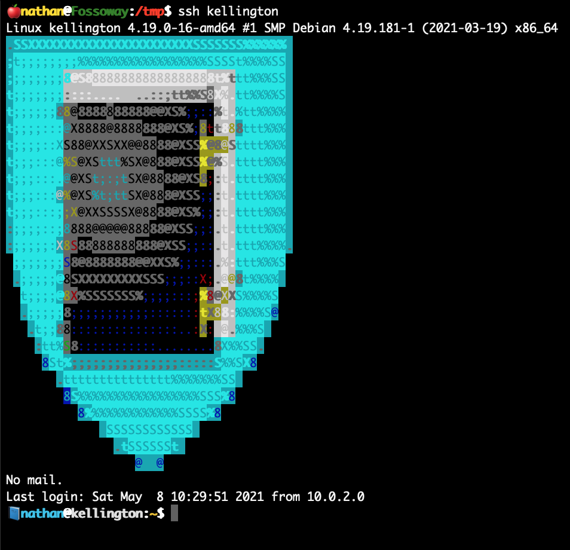

# Dotfiles
My dotfiles, presumably redacted heavily.  Unless I forget, in which case "wheeeee!"

## Disclaimer
This is all heavily customized to the way I do things.  You're welcome to poke around, but it's... it's really specific.

Among other things, it customizes a MOTD and Bash prompt based on the hostname (all hostnames are names of noble houses from _A Song of Ice and Fire_).

## Ansible
Ansible's my new favorite toy, and so my dotfiles are mostly implemented in Ansible playbooks, tasks, etc.  Ansible is used to install the dotfiles, deploy the dotfiles, and forms the basis of a lot of the more complex functionality made available in bash functions, etc.

### Phase One: Install
The dotfiles can be installed using `curl`, piping the [`install.sh`](/install.sh) script to Bash.

### Phase Two: Deploy
Once installed, the dotfiles are deployed via the [`deploy.sh`](/deploy.sh) script.

### Phase Three: Update
At any future date, the dotfiles should be cleanly updatable via the [`update.sh`](/update.sh) script.

## Bash
I've been using Bash for about twenty years, and for better or worse I'm really invested in Bashisms.  I have a library of a few hundred functions, some general-purpose, some very specific to the dumb things I spend my time doing.

